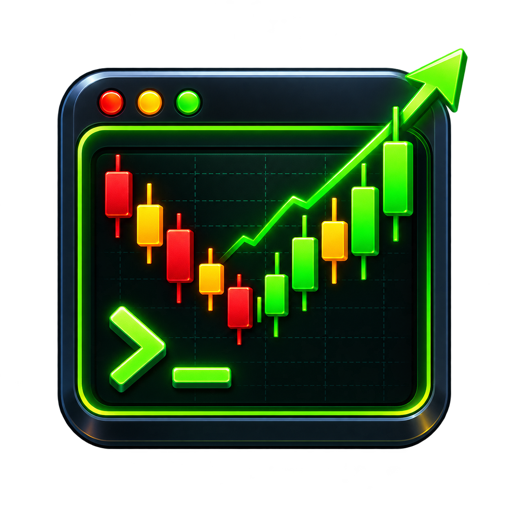
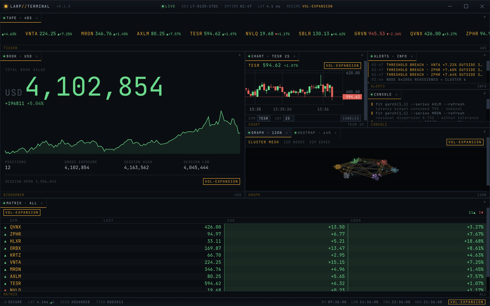
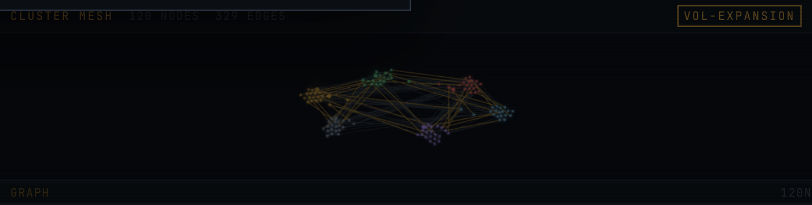
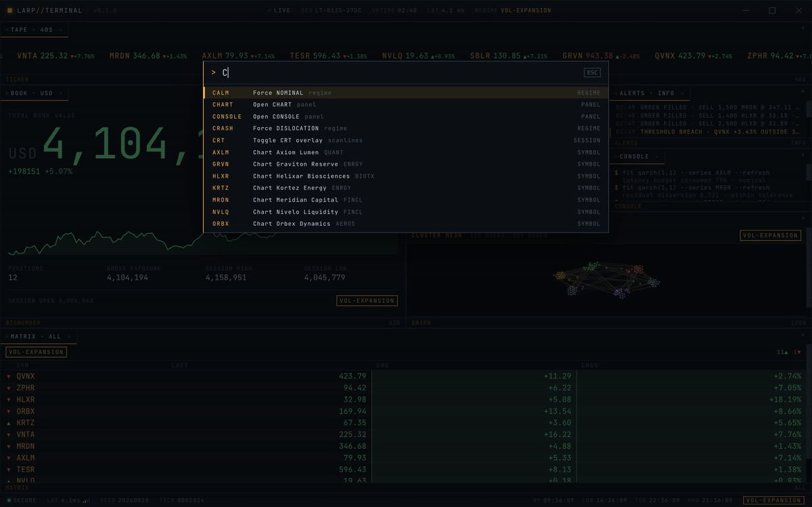

<div align="center">



# LARP Terminal

**A desktop "financial terminal" that streams convincing, entirely fake market data
and tells you absolutely nothing useful.**



</div>

---

## Why you would run this

Because sometimes you want to LARP as the kind of person who says "basis points" while
staring at six monitors.

LARP Terminal is for the bit: the stream backdrop, the desk photo, the video B-roll, the
second monitor at a party, the moment someone leans over your shoulder and asks if you
are "doing finance". Yes. Absolutely. Very busy. The fake tape is moving, the candles are
twitching, the alerts are yelling, and the big number is going up in a way that feels
important if you do not ask follow-up questions.

It is fake-finance cosplay with real machinery underneath. You get the whole terminal
fantasy: tickers, crashes, rallies, portfolio drama, cluster meshes, latency readouts,
and a console that types nonsense with complete confidence. None of it means anything.
That is the point. You are not trading. You are performing the ancient ritual of looking
busy in front of a graph.

Which makes it three things at once:

- **A prop.** Cinematic, dense, and always in motion. It never shows a loading state,
  never needs a network, and never says anything you have to explain.
- **A parody.** The disclaimer is in the splash screen, the status bar, and this README,
  because the whole point collapses if anyone mistakes it for real.
- **A genuinely non-trivial frontend.** Seeded simulation, factor-model correlations,
  60fps force-directed graph, streaming OHLC aggregation, a dockable workspace that
  persists to disk. If you want to read the code, it's a real codebase.

> [!WARNING]
> **Everything on screen is fake.** There is no market data feed, no broker, no account,
> and no network connection to anything. The numbers come from a simulation running
> locally on your machine. Nothing here is financial advice. Do not present it to anyone
> as a genuine trading tool, and do not use it as "proof" of anything.

---

## The panels

| Panel | What it shows |
|---|---|
| `CHART` | Candlestick / line chart, live OHLC aggregation at a configurable interval |
| `GRAPH` | Force-directed cluster mesh whose nodes migrate between clusters |
| `MATRIX` | Dense symbol table — tick direction, session change, breadth |
| `BOOK` | Portfolio value, session sparkline, exposure stats |
| `HEATMAP` | Sector grid tinted by average move |
| `ALERTS` | Event log whose rate and severity follow the market regime |
| `CONSOLE` | Auto-typing fake analysis with a blinking cursor |
| `TAPE` | Scrolling price marquee |
| `QUOTE` | Single-symbol readout |

Panels dock, split, tab, resize and pop between groups ([dockview](https://dockview.dev)).
The `+` in any group header adds another. The layout is written to disk and restored on
launch, and each panel's own settings ride along with it.



---

## The engine

The simulation lives in [`src/renderer/engine`](src/renderer/engine) and contains no
React at all — the UI only ever sees it through a Zustand store.

- **Seeded.** A `mulberry32` RNG means a given seed replays a session exactly.
- **Correlated, not identical.** Prices follow geometric Brownian motion driven by a
  shared market factor, a per-sector factor, and idiosyncratic noise. Each symbol has its
  own beta — `TESR` is the high-beta momentum name, `NVLQ` barely notices the market, and
  `GRVN` is the hedge and trades *against* the tape. That's why the screen never goes
  uniformly red.
- **Bounded by probability, not by clamps.** A restoring drift grows with the cube of the
  distance from a symbol's base price: invisible in normal trading, decisive at the
  extremes. Over two simulated hours prices stay within roughly 0.6×–1.5× of base without
  a single hard limit.
- **Drama on a timer.** A regime state machine cycles `calm → rally → crash → high_vol`.
  Crashes are rare and short but violent, and when one fires the whole shell flashes, the
  alert feed spikes, latency degrades, and every panel reacts at once.

---

## Commands



Press <kbd>⌘K</kbd> / <kbd>Ctrl+K</kbd>, then type a code and hit enter.

| Code | Effect |
|---|---|
| `CHART`, `GRAPH`, `ALERTS`, … | Open that panel |
| `TESR`, `GRVN`, … | Open a chart for that symbol |
| `CRASH`, `RALLY`, `CALM`, `VOL` | Force a market regime |
| `SEED` | Restart the simulation with a new seed |
| `CRT` | Toggle the scanline overlay |
| `RESET` | Restore the default layout |

Forcing a `CRASH` is the party trick.

<br clear="right" />

---

## Running it

```bash
npm install
npm run dev
```

| Script | Purpose |
|---|---|
| `npm run dev` | Electron + Vite with HMR |
| `npm test` | Vitest suite |
| `npm run typecheck` | Types for main, preload and renderer |
| `npm run build` | Typecheck and bundle |

## Building installers

```bash
npm run dist:mac     # .dmg (arm64 + x64)
npm run dist:win     # .exe (NSIS)
npm run dist:linux   # .AppImage
npm run pack         # unpacked app, for a quick local check
```

Artifacts land in `release/`. macOS builds are **unsigned** by default — Gatekeeper will
complain on another machine until you set a signing identity in `electron-builder.yml`.

---

## How it's put together

```
src/
├── main/        Electron main — frameless window, window controls, workspace file
├── preload/     The only bridge to the renderer (contextBridge, no Node in the page)
├── shared/      IPC contract shared by both sides
└── renderer/
    ├── engine/  The simulation. No React. Fully unit tested.
    ├── store/   Zustand bridge — panels subscribe to slices, never the whole snapshot
    ├── layout/  dockview host, panel registry, workspace persistence
    ├── panels/  One folder per panel type
    └── theme/   Design tokens
```

Adding a panel type means adding one entry to
[`panelRegistry.ts`](src/renderer/layout/panelRegistry.ts) — the host, the command
palette, the `+` menu and the empty-workspace screen all derive from it.

**Security posture:** context isolation on, node integration off, sandboxed preload, a
strict CSP in the packaged build, and no outbound network calls at all.

## Licence

MIT — see [LICENSE](LICENSE).

---

<div align="center">

*All data in this application is procedurally generated and fake. It is a satirical prop,
not a financial tool, and displays no real market information.*

</div>
